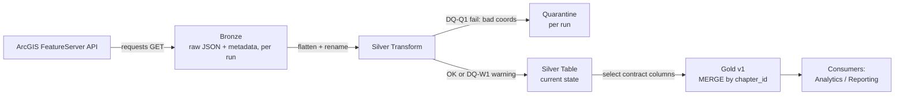

# University Chapters Medallion Pipeline

A thin Azure-style medallion pipeline (Bronze → Silver → Gold) built on Databricks/Spark, ingesting university chapter data (CA/OR/WA) from a public ArcGIS FeatureServer and publishing it as a governed, consumer-facing Gold data product.

## Overview

The pipeline ingests active university chapters in California, Oregon, and Washington from a public ArcGIS REST API, applies data quality rules (quarantine vs. warn-and-pass), and publishes a clean, contracted Gold table that downstream analytics/reporting consumers can rely on.

- **Bronze**: raw API response + ingest metadata, preserved per run (history by run)
- **Silver**: cleaned, typed, flattened, deduped, with DQ rules applied
- **Gold**: consumer-facing product — clean + warned rows only, published via idempotent MERGE

## Architecture



**Tech stack:** PySpark (Databricks notebooks), Delta Lake format, Unity Catalog Volumes for storage.

## How to Run

**Prerequisites:**
- A Databricks workspace with Unity Catalog enabled (tested on **Databricks Free Edition**).
- No credentials needed — the source API is public.

**Steps:**

1. Clone this repo, or link it via Databricks **Git folders** (Workspace → Git folders → Add Repo).
2. Create the Unity Catalog Volume used for storage (one-time setup):
   ```sql
   CREATE VOLUME IF NOT EXISTS workspace.default.university_chapters;
   ```
   This project uses the `workspace.default` catalog/schema, already available by default in most Databricks workspaces. If your workspace uses a different catalog/schema, update `BASE_PATH` in `notebooks/00_config.ipynb` accordingly.
3. Open and run the notebooks **in this order**, top to bottom ("Run All" is recommended for each):
   ```
   notebooks/00_config.ipynb           # shared constants (imported by others via %run, not run directly)
   notebooks/01_ingest_bronze.ipynb    # calls the API, writes raw data to Bronze
   notebooks/02_bronze_to_silver.ipynb # flattens, applies DQ rules, writes Silver + Quarantine
   notebooks/03_silver_to_gold.ipynb   # publishes Gold via idempotent MERGE
   notebooks/04_tests.ipynb            # automated checks against the latest run
   ```
4. Re-running the full sequence is safe — Gold is published via `MERGE` (upsert by `chapter_id`), so repeat runs update existing rows rather than duplicating them.

**Note on synthetic test data:** `02_bronze_to_silver.py` deliberately injects two synthetic rows (`TEST-BAD-001` with invalid coordinates, `TEST-WARN-001` with an unknown city) into the live API data, so both DQ-Q1 (quarantine) and DQ-W1 (warning) paths can be verified on every run, per the assignment's requirement. See [Trade-offs](#trade-offs--production-next-steps) for how this would change for a production run.

## Data Layout

```
/Volumes/workspace/default/university_chapters/
├── bronze/university_chapters/<run_id>/raw_response.json
├── silver/university_chapters/                (Delta, overwritten each run)
├── gold/university_chapters/v1/                (Delta, MERGE/upsert each run)
└── quarantine/university_chapters/<run_id>/    (Delta)
```

Bronze and Quarantine are partitioned by run (history preserved). Silver and Gold represent current state only, per assignment scope (no SCD2 required).

## Data Quality Rules

| Rule | Severity | Condition | Outcome |
|---|---|---|---|
| **DQ-Q1** | Quarantine | Invalid/missing/out-of-range longitude or latitude | Excluded from Silver/Gold; written to Quarantine with `reason_code = INVALID_COORDINATES` |
| **DQ-W1** | Warning | `city` null, blank, or `UNKNOWN` (case-insensitive) | Published to Gold with `dq_status = WARNING`, `dq_warnings = MISSING_OR_UNKNOWN_CITY` |

Full detail in [`CONTRACT.md`](./CONTRACT.md).

## Data Product Contract

See [`CONTRACT.md`](./CONTRACT.md) for the full contract: schema, freshness SLA, quality rules, versioning, and classification.

## Testing

`notebooks/04_tests.ipynb` runs automated assertions against the most recent pipeline run:
- No quarantined `chapter_id` appears in Gold
- At least one `WARNING`-status row exists in Gold with the correct reason code (verifying DQ-W1 end-to-end)
- Gold's schema exactly matches the published contract columns — no technical/internal fields leak through

These tests rely on the synthetic test rows being present in the run being tested (see note above).

## Trade-offs & Production Next Steps

- **Storage**: Used Unity Catalog Volumes (`/Volumes/workspace/default/...`) rather than ADLS Gen2, since this was built on Databricks Free Edition without an Azure subscription. In production, this would be an ADLS Gen2 container mounted via a Unity Catalog external location — the code (Delta read/write) would be unchanged, only `BASE_PATH` would differ.
- **Ingestion pattern**: Full extract on every run (no CDC). Reasonable at this data volume (a handful of rows); at scale, would filter on a source `EditDate`/last-modified field if available.
- **Gold versioning strategy**: Gold uses SCD Type 1 (MERGE/upsert, overwrite-in-place) rather than SCD Type 2, per assignment scope. Historical snapshots are preserved instead at the Bronze layer via append-by-run.
- **Orchestration**: No scheduler configured (out of scope for this exercise). In production, this would run as a Databricks Job on a schedule, with failure notifications (email/Slack) wired to alert the data product owner if the "fail loudly" checks trigger.
- **Synthetic test rows**: Currently injected inline in `02_bronze_to_silver.py` for demonstration purposes. In production, these would move to an offline fixture-based test suite (testing the DQ transform functions in isolation) rather than being injected into live pipeline runs.
- **Run metadata**: Run history is currently inferred from folder-naming conventions (timestamp-prefixed run IDs). In production, this would be tracked in a dedicated control/audit table logging run status, row counts, and timing explicitly.
